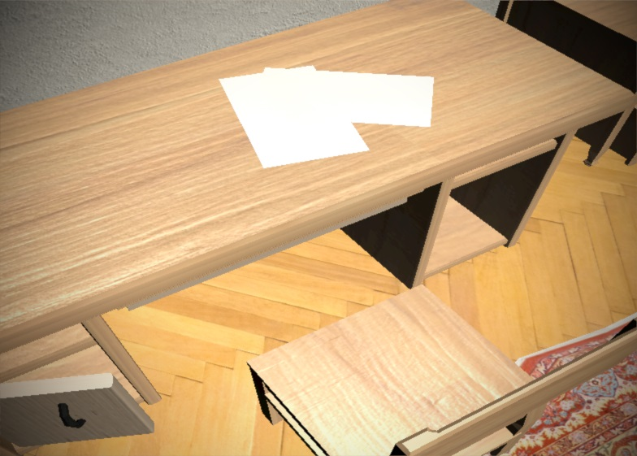
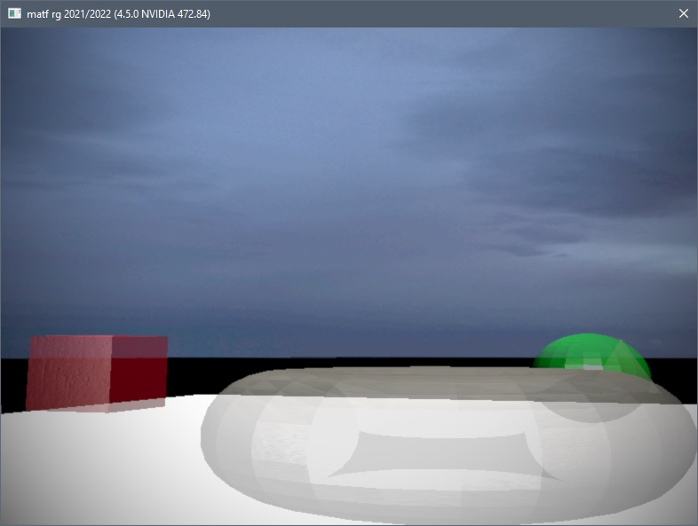

# matf-rg 2022

## Material of group "A"

- Framebuffers
- Cubemaps

## Material of group "B"

- Normal mapping, Parallax Mapping

### Parallax Mapping

It isn't finished yet, the texture is loaded and transferred to the shader but there will be no effect.

## How to use

### Changing scenes

`1` - the first scene is default,

`2` - the second scene with simple geometry,

`3` - the third scene with one quad.

### Camera

`ALT`+`left mouse button` (hold) - orbit around the center,

`ALT`+`middle mouse button` (hold) - move the center point,

`mouse wheel` - decrease or increase the distance to the center.

### Program

`ESCAPE` - close the program.

## Video

https://www.youtube.com/watch?v=alylufATbGI

## Pictures

## Note

The first scene loaded (scene `1`) requires 1500MB of video memory and may take some time to load.

## Source scene files

https://www.dropbox.com/s/gjxj2bvfdjgnsws/matf-rg-modeli.7z?dl=1
